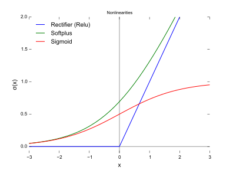
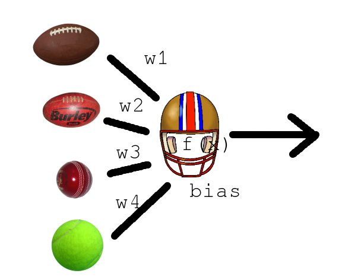

# Deep Learning Tutorial

#### Abram Hindle
#### <abram.hindle@ualberta.ca>
#### http://softwareprocess.ca/

Slides stolen gracefully from Ben Zittlau

Slide content under CC-BY-SA 4.0 and MIT License for source
code. Slide Source code is MIT License as well.


## Start

First off lets get a useful Python environment!

Please install theanets and bpython.

`````
pip install theanets
pip install bpython
`````

otherwise consider provisioning a vagrant box defined by the
vagrantfile in the vagrant/ directory.


## Data
We're planning on using some data. TBD.


# Intro
### What is machine learning?

Building a function from data to classify, predict, group, or represent data.


# Intro
### Motivational Example

Imagine we have this data:

 -> z where z is red")

[See src/genslice.py to see how we made it.](src/genslice.py)


# Intro
### Make your own function

``` python
def in_circle(x,y,cx,cy,radius):
    return (x - float(cx)) ** 2 + (y - float(cy)) ** 2 < radius**2

def mysolution(pt,outer=0.3):
    return in_circle(pt[0],pt[1],0.5,0.5,outer) and not in_circle(pt[0],pt[1],0.5,0.5,0.1)
```

```
>>> myclasses = np.apply_along_axis(mysolution,1,test[0])
>>> print "My classifier!"
My classifier!
>>> print "%s / %s " % (sum(myclasses == test[1]),len(test[1]))
181 / 200 
>>> print theautil.classifications(myclasses,test[1])
[('tp', 91), ('tn', 90), ('fp', 19), ('fn', 0)]
```


# Intro
### Machine Learning

There are a few kinds of tasks or functions that could help us here.

* Classification: given some input, predict the class that it belongs
  to. Given a point is it in the red or in the blue?
* Regression: Given a point what will its value be? In the case of a
  function with a continuous or numerous discrete outputs it might be
  appropriate.
* Representation: Learn a smaller representation of the input
  data. E.g. we have 300 features lets describe them in a 128bit hash.


# Intro 
### An example classifier

1-NN: 1 Nearest Neighbor.

Given the data, we produce a function that
outputs the CLASS of the nearest neighbour to the input data.

Whoever is closer, is the class. 3-NN is 3-nearest neighbors whereby
we use voting of the 3 neighbors instead.


# Intro
### An example classifier: 1-NN

[src/slice-classifier.py](src/slice-classifier.py)

``` python
def euclid(pt1,pt2):
    return sum([ (pt1[i] - pt2[i])**2 for i in range(0,len(pt1)) ])

def oneNN(data,labels):
    def func(input):
        distance = None
        label = None
        for i in range(0,len(data)):
            d = euclid(input,data[i])
            if distance == None or d < distance:
                distance = d
                label = labels[i]
        return label
    return func
```


# Intro
### An example classifier: 1-NN

``` python
>>> learner = oneNN(train[0],train[1])
>>> 
>>> oneclasses = np.apply_along_axis(learner,1,test[0])
>>> print "1-NN classifier!"
1-NN classifier!
>>> print "%s / %s " % (sum(oneclasses == test[1]),len(test[1]))
198 / 200 
>>> print theautil.classifications(oneclasses,test[1])
[('tp', 91), ('tn', 107), ('fp', 2), ('fn', 0)]

```

1-NN has great performance in this example, but it uses Euclidean
distance and the dataset is really quite biased to the positive
classes.

Thus we showed a simple learner that classifies data.


# Intro
### Machine Learning: Neural Networks

Neural networks or "Artificial Neural Networks" are a flexible class
of non-linear machine learners. They have been found to be quite
effective as of late.

Neural networks are composed of neurons. These neurons try to emulate
biological neurons in the most metaphorical of senses. Given a set of
inputs they produce an output.


## Neurons

Neurons have functions.

* Rectified Linear Units have been shown to train quite well and
  achieve good results. By they aren't easier to differentiate.
  f(x) = max(0,x)
* Sigmoid functions are slow and were the classical neural network
  neuron, but have fallen out of favour. They will work when nothing
  else will. f(x) = 1/(1 + e^-x)
* Softplus is a RELU that is slower to compute but differentiable.
  f(x) = ln(1 + e^x)


## Neurons




## Neurons

The inputs to a neural network? The outputs of connected nodes times
their weight + a bias.

neuron(inputs) = neuron_f( sum(weights * inputs) + bias  )


