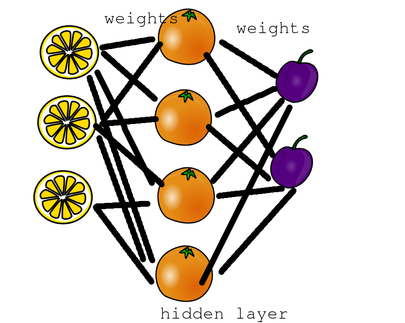
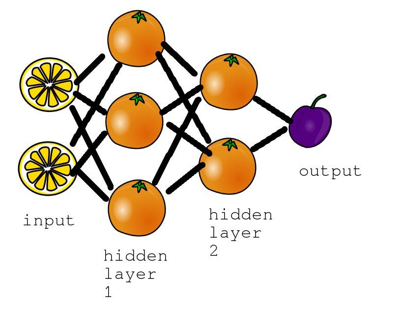

# Deep Learning Tutorial

#### Abram Hindle
#### <abram.hindle@ualberta.ca>
#### http://softwareprocess.ca/

Slides stolen gracefully from Ben Zittlau

Slide content under CC-BY-SA 4.0 and MIT License for source
code. Slide Source code is MIT License as well.


## Start

First off lets get a useful Python environment!

Please install theanets and bpython.

`````
pip install --user keras
pip install --user tensorflow
pip install --user scikit-learn
`````

Get a recent version of this presentation:

```
git clone https://github.com/abramhindle/keras-deep-learning-tutorial.git
```


# Intro
### What is machine learning?

Building a function from data to classify, predict, group, or represent data.


# Intro
### Machine Learning

There are a few kinds of tasks or functions that could help us here.

* Classification: given some input, predict the class that it belongs
  to. Given a point is it in the red or in the blue?
* Regression: Given a point what will its value be? In the case of a
  function with a continuous or numerous discrete outputs it might be
  appropriate.
* Representation: Learn a smaller representation of the input
  data. E.g. we have 300 features lets describe them in a 128-bit hash.


# Intro
### Motivational Example

Imagine we have this data:

 -> z where z is red")

[See src/genslice.py to see how we made it.](src/genslice.py)


# Intro
### Make your own function

``` python
def in_circle(x,y,cx,cy,radius):
    return (x - float(cx)) ** 2 + (y - float(cy)) ** 2 < radius**2

def mysolution(pt,outer=0.3):
    return in_circle(pt[0],pt[1],0.5,0.5,outer) and not in_circle(pt[0],pt[1],0.5,0.5,0.1)
```

```
>>> myclasses = np.apply_along_axis(mysolution,1,test[0])
>>> print "My classifier!"
My classifier!
>>> print "%s / %s " % (sum(myclasses == test[1]),len(test[1]))
181 / 200 
>>> print theautil.classifications(myclasses,test[1])
[('tp', 91), ('tn', 90), ('fp', 19), ('fn', 0)]
```


# Intro 
### An example classifier

1-NN: 1 Nearest Neighbor.

Given the data, we produce a function that
outputs the CLASS of the nearest neighbour to the input data.

Whoever is closer, is the class. 3-NN is 3-nearest neighbors whereby
we use voting of the 3 neighbors instead.


# Intro
### An example classifier: 1-NN

[src/slice-classifier.py](src/slice-classifier.py)

``` python
def euclid(pt1,pt2):
    return sum([ (pt1[i] - pt2[i])**2 for i in range(0,len(pt1)) ])

def oneNN(data,labels):
    def func(input):
        distance = None
        label = None
        for i in range(0,len(data)):
            d = euclid(input,data[i])
            if distance == None or d < distance:
                distance = d
                label = labels[i]
        return label
    return func
```


# Intro
### An example classifier: 1-NN

``` python
>>> learner = oneNN(train[0],train[1])
>>> 
>>> oneclasses = np.apply_along_axis(learner,1,test[0])
>>> print "1-NN classifier!"
1-NN classifier!
>>> print "%s / %s " % (sum(oneclasses == test[1]),len(test[1]))
198 / 200 
>>> print theautil.classifications(oneclasses,test[1])
[('tp', 91), ('tn', 107), ('fp', 2), ('fn', 0)]

```

1-NN has great performance in this example, but it uses Euclidean
distance and the dataset is really quite biased to the positive
classes.

Thus we showed a simple learner that classifies data.


# Intro

* That's really interesting performance and it worked but will it
  scale and continue to work?

* 1-NN doesn't work for all problems. And it is dependent on linear
  relationships.

* What if our problem is non-linear?


# Intro

* Neural networks are popular
   * Creating AI for Go
   * Labeling Images with cats and dogs
   * Speech Recognition
   * Text summarization
   * [Guitar Transcription](https://peerj.com/preprints/1193.pdf)
   * Learn audio from video[1](https://archive.org/details/DeepLearningBitmaptoPCM/)[2](http://softwareprocess.es/blog/blog/2015/08/10/deep-learning-bitmaps-to-pcm/)

* Neural networks can not only classify, but they can create content,
  they can have complicated outputs.

* Neural networks are generative!


# Intro
### Machine Learning: Neural Networks

Neural networks or "Artificial Neural Networks" are a flexible class
of non-linear machine learners. They have been found to be quite
effective as of late.

Neural networks are composed of neurons. These neurons try to emulate
biological neurons in the most metaphorical of senses. Given a set of
inputs they produce an output.


## Neurons

Neurons have functions.

* Rectified Linear Units have been shown to train quite well and
  achieve good results. By they aren't easier to differentiate.
  f(x) = max(0,x)
* Sigmoid functions are slow and were the classical neural network
  neuron, but have fallen out of favour. They will work when nothing
  else will. f(x) = 1/(1 + e^-x)
* Softplus is a RELU that is slower to compute but differentiable.
  f(x) = ln(1 + e^x)


## Neurons


## Neurons

The inputs to a neural network? The outputs of connected nodes times
their weight + a bias.

neuron(inputs) = neuron_f( sum(weights * inputs) + bias  )


## Multi-layer perceptron

Single hidden layer neural network.




## Deep Learning

There's nothing particularly crazy about deep learning other than it has more hidden layers.

These hidden layers allow it to compute state and address the intricacies of complex functions. But each hidden layer adds a lot of search space.


## Deep Learning




## Search

How do we find the different weights?

Well we need to search a large space. A 2x3x2 network will have 2*3*2
weights + 5 biases (3 hidden, 2 output) resulting in 17
parameters. That's already a large search space.

Most search algorithms measure their error at a certain point
(difference between prediction and actual) and then choose a direction
in their search space to travel. They do this by sampling points
around themselves in order to compute a gradient or slope and then
follow the slope around.

Here's a 3D demo of different search algorithms.

[Different Search Parameters](http://www.robertsdionne.com/bouncingball/)


## Let's deep learn on our problem

 -> z where z is red")

Please open [slice-classifier](./src/slice-classifier.py) and a python
interpreter such as bpython. Search for Part 3 around line 100.


## Now let's discuss posing problems for neural networks

* Scaling inputs: Scaling can sometimes help, so can
  standardization. This means constraining values or re-centering
  them. It depends on your problem and it is worth trying.

* E.g. min max scaling:

``` python
def min_max_scale(data):
    '''scales data by minimum and maximum values between 0 and 1'''
    dmin = np.min(data)
    return (data - dmin)/(np.max(data) - dmin)
```


## The problem

* [posing.py](src/posing.py) tries to show the problem of taking
  random input data and determine what distribution it comes from.
  That is what function can produce these random values.

* Let's open up [posing.py](src/posing.py) and get an interpreter
  going.


## Experiment 1

* Given 1 single sample what distribution does it come from?


## Experiment 2

* Given 40 samples what distribution does it come from?


## Experiment 3

* Given 40 sorted samples what distribution does it come from?


## Experiment 4

* Given 40 histogrammed samples what distribution does it come from?


## Representation: Inputs

* For discrete values consider discrete inputs neurons. E.g. if you have 3 letters are your input you should have 3 * 26 input numerous. Each neuron is "one-hot" -- 1 neuron is set to 1 to indicate that 1 discerete value. An input of AAA would be: 1 0 0 0 0 0 0 0 0 0 0 0 0 0 0 0 0 0 0 0 0 0 0 0 0 0 1 0 0 0 0 0 0 0 0 0 0 0 0 0 0 0 0 0 0 0 0 0 0 0 0 0 1 0 0 0 0 0 0 0 0 0 0 0 0 0 0 0 0 0 0 0 0 0 0 0 0 0
  * ZZZ would be 0 0 0 0 0 0 0 0 0 0 0 0 0 0 0 0 0 0 0 0 0 0 0 0 0 1 0 0 0 0 0 0 0 0 0 0 0 0 0 0 0 0 0 0 0 0 0 0 0 0 0 1 0 0 0 0 0 0 0 0 0 0 0 0 0 0 0 0 0 0 0 0 0 0 0 0 0 1


## Representation: Inputs

* For groups of elements consider representing them as their counts.
* E.g. 3 cats, 4 dogs, 1 car as: 3 4 1 on 3 input neurons.
* Neural networks work well with distributions as inputs and distributions as outputs


## Representation: Words

* Words can be represented as word counts where by your vector is the count of each word per document -- you might have a large vocabulary so watch out!
* n-grams are popular too with one-hot encoding


## Representaiton: Images

* Each neuron can represent a pixel represented from 0 to 1
* You can have images as output too!


## Representation: Outputs

* Do not ask the neural network to distingush discrete values on 1 neuron. Don't expect 1 neuron to output 0.25 for A and 0.9 for B and 1.0 for C. Use 3 neurons!
* Distribution outputs are good
* Interpretting the output is fine for regression problems


## References

* [Theanets Documentation](https://theanets.readthedocs.org/en/stable/)
* [A Practical Guide to TrainingRestricted Boltzmann Machines](https://www.cs.toronto.edu/~hinton/absps/guideTR.pdf)
* [MLP](http://deeplearning.net/tutorial/mlp.html#mlp)
* [Deep Learning Tutorials](http://www.iro.umontreal.ca/~pift6266/H10/notes/deepintro.html)
* [Deep Learning Tutorials](http://deeplearning.net/tutorial/)
* [Coursera: Hinton's Neural Networks for Machine Learning](https://www.coursera.org/course/neuralnets)
* [The Next Generation of Neural Networks](https://www.youtube.com/watch?v=AyzOUbkUf3M)
* [Geoffrey Hinton: "Introduction to Deep Learning & Deep Belief Nets"](https://www.youtube.com/watch?v=GJdWESd543Y)
* Bengio's Deep Learning
  [(1)](https://www.youtube.com/watch?v=JuimBuvEWBg)[(2)](https://www.youtube.com/watch?v=Fl-W7_z3w3o)
* [Nvidia's Deep Learning tutorials](https://developer.nvidia.com/deep-learning-courses
)
* [Udacity Deep Learning MOOC](https://www.udacity.com/course/deep-learning--ud730)
